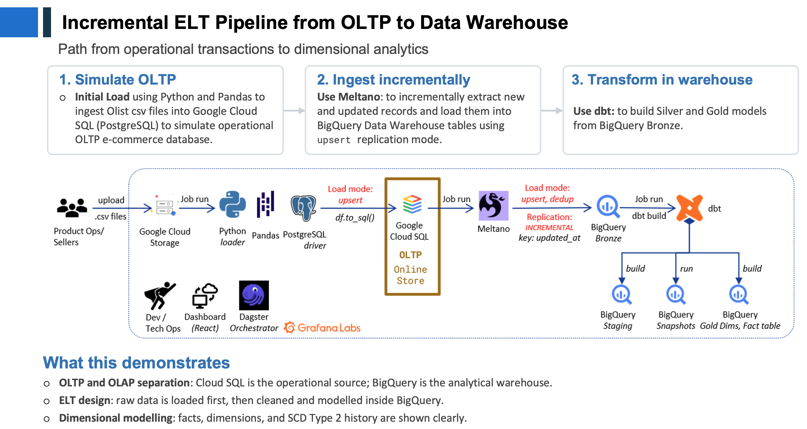
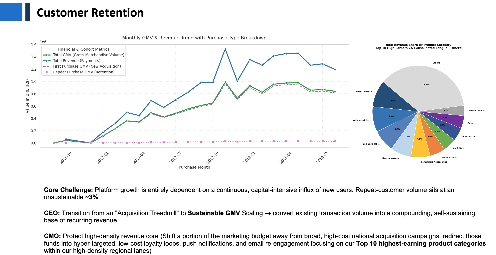
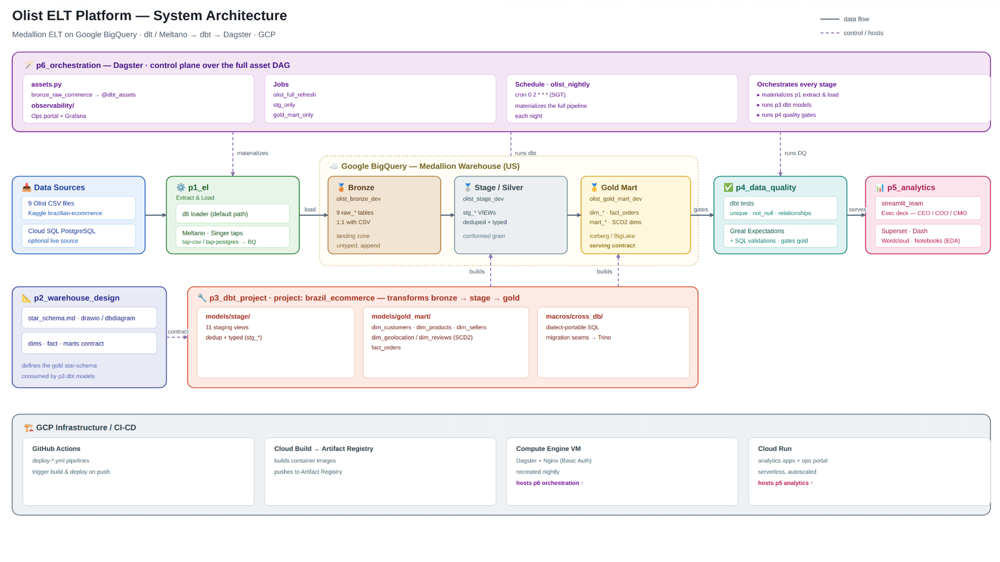

# Olist E-Commerce ELT and Analytics Platform

This team project builds an end-to-end analytics platform for the public Olist Brazilian
e-commerce dataset. It separates operational and analytical workloads, incrementally loads
source data into a cloud warehouse, transforms it into governed dimensional models, tests the
result, and serves decision-ready analysis through interactive dashboards.

The business question is not simply whether sales are growing, but whether that growth is
sustainable. The analysis connects customer retention, marketplace experience, geography,
delivery performance, and review scores to investigate a central hypothesis: delivery-quality
failures turn acquired customers into one-time buyers and keep the business dependent on costly
new-customer acquisition.

## Project approach

The primary workflow presented by the team is an **ELT pipeline** from a simulated OLTP system
to a dimensional analytical warehouse:

```text
9 Olist CSV files
    -> PostgreSQL on Cloud SQL (simulated OLTP)
    -> Meltano/Singer incremental extraction and upsert loading
    -> BigQuery bronze tables
    -> dbt staging views and SCD snapshots
    -> BigQuery gold star schema
    -> dbt quality tests
    -> Streamlit, Dash, Superset, notebooks, and review-text analysis
```

The repository also supports a direct CSV-to-BigQuery load for repeatable development and
demonstration runs. Dagster represents the ingestion and dbt transformations as software-defined
assets and materializes the full dependency graph on demand or on a nightly schedule.



*The presented ELT workflow separates the PostgreSQL operational store from BigQuery analytics,
uses Meltano for incremental ingestion, and delegates in-warehouse modelling to dbt.*

## Techniques and methods used

| Area | Techniques and implementation |
| --- | --- |
| **Source simulation and ingestion** | Python/Pandas seed the Olist CSV data into PostgreSQL to reproduce an operational e-commerce source. Meltano uses Singer taps and targets for incremental replication into BigQuery, with upsert handling for keyed entities and an append-oriented path for geolocation history. A direct BigQuery CSV loader provides an alternative development path. |
| **ELT and medallion architecture** | Raw records land first in a bronze layer; transformation is then performed inside BigQuery. Environment-specific bronze, stage, and gold datasets keep development and production assets separate. Source-to-bronze row-count reconciliation checks load completeness. |
| **Data preparation** | dbt staging views apply deterministic deduplication with window functions, select the latest record for changing entities, standardise types and strings, handle nulls, and prevent many-to-many join fan-out. |
| **Dimensional modelling** | The gold layer follows a Kimball-style star schema. `fact_orders` is modelled at order-item grain with a composite business key, while customer, seller, product, review, and geolocation dimensions provide descriptive context. Sellers are enriched through zip-code geolocation and product categories are translated to English. |
| **Historical change tracking** | dbt snapshots implement Slowly Changing Dimension Type 2 history. Check- and timestamp-based strategies create versioned product, review, and geolocation records with surrogate keys, validity ranges, and current-row flags. |
| **Data quality** | dbt schema and data tests cover uniqueness, non-null constraints, accepted values, referential integrity, composite-key uniqueness, and BigQuery data types. Transformation logic also nulls implausible monetary values and exposes explicit quality flags for invalid dates, overdue or long delivery, missing payment data, and orders without items. Test failures can be persisted for audit; supplementary business SQL and Great Expectations test designs are documented in `p4_data_quality/`. |
| **Analytics methods** | SQL and Pandas collapse the item-grain fact into order- and customer-level analytical sets. Methods include KPI aggregation, cohort retention matrices, repeat-purchase analysis, RFM segmentation, monthly GMV decomposition, delivery-delay bucketing, geospatial late-rate comparison, review-score segmentation, reorder-rate comparison, and assumption-driven CAC/retention scenarios. |
| **Text analysis** | The review application performs lightweight NLP on Brazilian Portuguese comments: normalisation, tokenisation, Portuguese/domain stop-word removal, word and bigram frequencies, word clouds, score-based comparison, and optional Google Cloud translation for English display. |
| **Visualisation and serving** | Plotly-based Streamlit and Dash applications provide executive, retention, delivery, review, catalogue, and diagnosis views. Superset and exploratory notebooks provide additional BI and EDA paths. Containerised applications are designed for Cloud Run deployment. |
| **Orchestration and operations** | Dagster asset lineage connects bronze ingestion to dbt staging and gold models. Separate full-refresh, staging-only, and gold-only jobs support development, while the full pipeline is scheduled for 02:00 Asia/Singapore. The repository also includes an operations portal, provisioned Grafana dashboards, and a broader observability plan for infrastructure, pipeline status, freshness, quality, and cost. |

## Findings highlighted in the presentation

The presentation frames the outputs for executive action rather than as isolated technical
metrics. Its headline findings include:



*Monthly GMV is overwhelmingly associated with first purchases, while repeat-purchase GMV remains
small; the category breakdown identifies the highest-value areas for targeted retention activity.*

- Repeat-customer volume is approximately **3%**, indicating that growth is dominated by new
  customer acquisition rather than a compounding returning-customer base.
- Late delivery is strongly associated with poor experience: the presentation reports severe
  detractor reviews for **62.3% of late orders**, compared with **9.2% of on-time orders**.
- Satisfaction deteriorates as delays increase; at a delay of four or more days, the reported
  average review score falls to approximately **1.90 out of 5**.
- This links what appear to be separate executive problems into one chain:
  **late delivery -> low review score -> lower likelihood of repeat purchase -> continued
  acquisition pressure**.

These are descriptive associations from the Olist dataset, not a causal experiment. The
dashboard therefore uses them to prioritise operational investigation and retention initiatives,
rather than to claim that delivery delay alone causes churn.

## System architecture



*The system view maps the repository modules onto the BigQuery medallion layers and shows Dagster
coordinating ingestion, dbt transformations, quality controls, analytics serving, and GCP
deployment components. Some elements represent the documented target architecture.*

## Repository guide

| Path | Purpose |
| --- | --- |
| [`p1_el/`](p1_el/) | PostgreSQL/Meltano and direct CSV extraction-and-load paths |
| [`p2_warehouse_design/`](p2_warehouse_design/) | Dimensional model and warehouse design artifacts |
| [`p3_dbt_project/`](p3_dbt_project/) | dbt staging, gold models, snapshots, tests, and lineage |
| [`p4_data_quality/`](p4_data_quality/) | Quality documentation, business validations, and expectation designs |
| [`p5_analytics/`](p5_analytics/) | Dashboards, notebooks, KPI logic, geospatial views, and review-text analysis |
| [`p6_orchestration/`](p6_orchestration/) | Dagster jobs, schedules, deployment, and observability components |
| [`p7_docs/`](p7_docs/) | System architecture and project documentation |

For the full platform view, see the [architecture diagram](p7_docs/architecture_diagram.md).

## Core technology stack

- **Data and cloud:** PostgreSQL/Cloud SQL, Google BigQuery, Google Cloud Run
- **Ingestion:** Python, Pandas, Meltano, Singer
- **Transformation and modelling:** dbt, SQL, BigQuery window functions and snapshots
- **Quality:** dbt tests, dbt-utils, dbt-expectations, documented Great Expectations checks
- **Orchestration:** Dagster and dagster-dbt
- **Analytics:** Pandas, Plotly, Streamlit, Dash, Superset, Jupyter
- **Operations:** Docker, Nginx, Grafana, Google Cloud Monitoring and Logging
