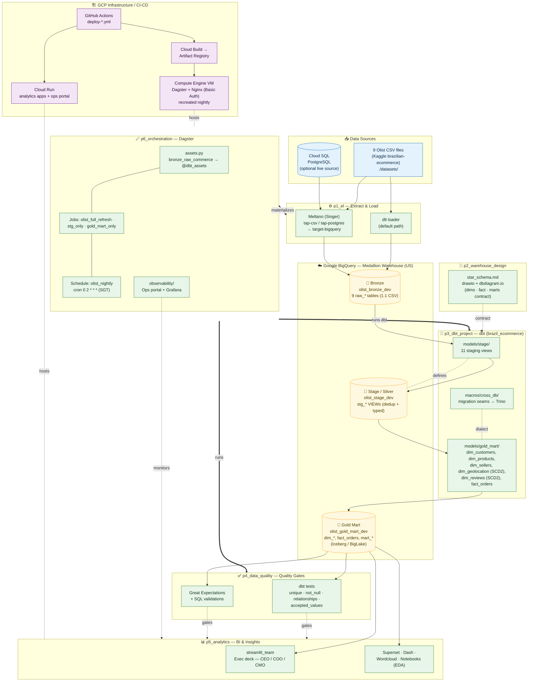

# Olist ELT Platform — Architecture Diagram

This document describes **how the solution is designed**: the major building blocks
(p1–p6), the GCP infrastructure they run on, and the medallion data layers in BigQuery.

- **p1_el** — Extract & Load (dlt / Meltano → BigQuery bronze)
- **p2_warehouse_design** — Dimensional star-schema contract
- **p3_dbt_project** — dbt transforms (bronze → stage/silver → gold)
- **p4_data_quality** — dbt tests + Great Expectations quality gates
- **p5_analytics** — Streamlit / Superset / Dash / notebooks BI layer
- **p6_orchestration** — Dagster asset DAG, scheduling & observability

---

## C4-style System Architecture

---

## Layered View (responsibility per module)

| Layer | Module | Tech | Output |
|-------|--------|------|--------|
| Ingestion | **p1_el** | dlt / Meltano (Singer) | `olist_bronze_dev` raw tables |
| Design contract | **p2_warehouse_design** | drawio / dbdiagram | `star_schema.md` |
| Transformation | **p3_dbt_project** | dbt + BigQuery | `olist_stage_dev`, `olist_gold_mart_dev` |
| Quality gate | **p4_data_quality** | dbt tests + Great Expectations | QA report (gates gold) |
| Serving / BI | **p5_analytics** | Streamlit, Superset, Dash | Exec dashboards |
| Orchestration | **p6_orchestration** | Dagster + Grafana | Asset DAG, nightly schedule |

**Storage:** BigQuery medallion (bronze → silver/stage → gold), gold as Iceberg/BigLake.
**Hosting:** Dagster on Compute Engine VM (Nginx Basic Auth, recreated nightly); analytics
apps + ops portal on Cloud Run. **CI/CD:** GitHub Actions → Cloud Build → Artifact Registry.
