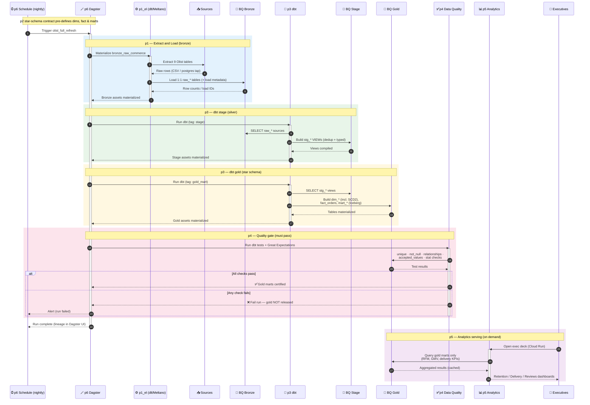

# Olist ELT Platform — End-to-End Sequence Diagram

This document focuses on the **end-to-end pipeline flow**, showing how a nightly run
travels through every component (p1 → p6) from raw CSV ingestion to executive analytics.

The flow is driven by **p6 (Dagster)**, which materializes the asset DAG:
`bronze_raw_commerce → dbt stage → dbt gold → data-quality tests`, after which
**p5 (analytics)** serves the gold marts to executives.

---

## Nightly Pipeline Run — Sequence

---

## Flow summary (p1 → p6)

| # | Stage | Component | Action |
|---|-------|-----------|--------|
| 1 | Trigger | **p6** Dagster `olist_nightly` | Kicks off `olist_full_refresh` at 02:00 SGT |
| 2 | Extract & Load | **p1_el** | dlt / Meltano pulls 9 sources → bronze `raw_*` |
| 3 | Stage / Silver | **p3** dbt | `stg_*` views: dedup + type-clean (per **p2** contract) |
| 4 | Gold | **p3** dbt | `dim_*` (SCD2), `fact_orders`, `mart_*` Iceberg tables |
| 5 | Quality gate | **p4** | dbt tests + Great Expectations — gold released only if green |
| 6 | Serve | **p5** | Streamlit exec deck queries gold marts for CEO/COO/CMO |

> **p2 (warehouse design)** is the up-front contract, not a runtime step — it defines the
> dim/fact/mart shapes that p3 implements and p4 validates. **p6** orchestrates and
> observes steps 2–5; **p5** consumes the certified gold marts on demand.
